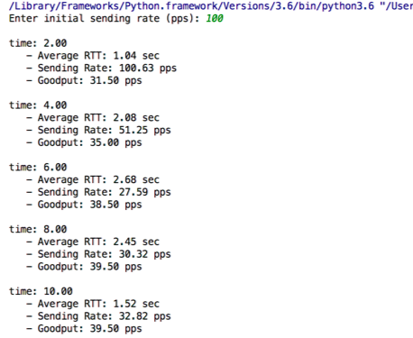
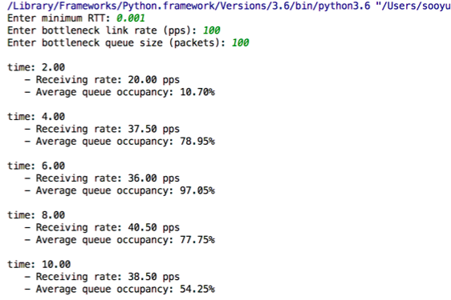
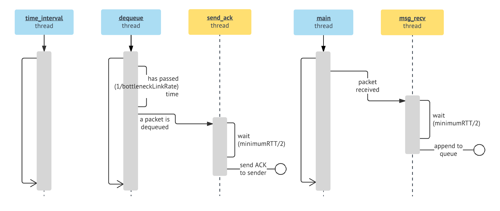

Program Environment: Windows 10

## Network Emulation & Dynamic Rate Control

* UDP socket programming
* Consists of two programs: Sender, Receiver
* Possible to run multiple senders with a single receiver

### **Functionalities**

* Sender  

	* When the sender program starts, ask the user the ***initial sending rate*** (e.g., 10 > 10 packets per second (pps))
		* If the sending rate is 10, the sender transmits a packet ever 1/10 seconds (0.1 seconds)
	* The packet size is 1000 bytes
	* Whenever the sender receives an ACK, update the average RTT
	* Print the **average RTT**, **sending rate**, and **goodput** every two seconds
		* goodput = # of ACKs / 2 sec
	* Do not retransmit for reliable data transfer
* Receiver  

	* When the receiver program starts, ask the user the following:
		* minimum RTT (e.g., 0.1 > 100 ms)
		* bottleneck link rate (e.g., 10 > 10 packets per second)
		* bottleneck queue size (e.g., 10 > 10 packets to store)
	* When the receiver program receives/sends packets (data and ACK/NACK), emulate the given RTT by delaying the packet forwarding
		* If a data packet arrives, foward it to the bottleneck queue
		* If the queue is full, send a NACK packet to the sender program
	* Get a packet from the queue one by one at the bottleneck link rate and send an ACK packet to the sender
	* Print the **receiving rate** and **average queue occupancy** every two seconds
		* receiving rate = # of ACKs / 2 sec
		* average queue occupancy: average the queue occupancy every 100 ms for 2 seconds

### Sender Rate Control

* When receiving ACKs: sending rate = sending rate + 1.0 / sending rate
* When receiving NACKs
	* sending rate = sending rate / 2.0
	* reduce the sending rate only once for two seconds

### Receiver Program Design

